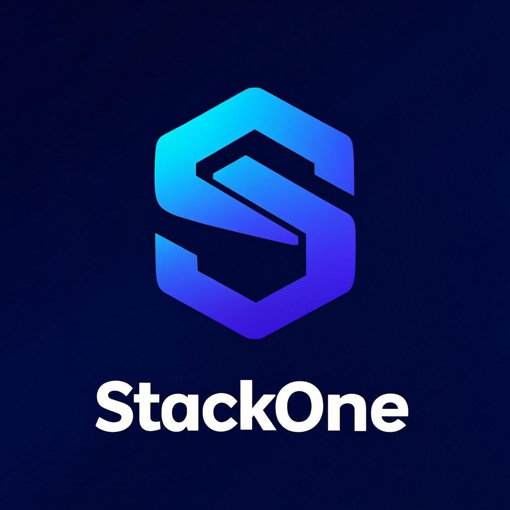

# StackOne | Engineering the Extraordinary

A world-class, dark premium landing page for StackOne — a software agency building extraordinary digital products across Africa and beyond. Built with Next.js 16, React 19, Tailwind CSS 4, and framer-motion.



---

## Tech Stack

| Layer | Technology |
|---|---|
| Framework | Next.js 16 (App Router) |
| UI | React 19, Tailwind CSS 4 |
| Animations | framer-motion, CSS Keyframes |
| Components | Radix UI, shadcn/ui |
| Language | TypeScript |
| Fonts | Satoshi (fontshare), JetBrains Mono (Google Fonts) |
| Icons | Material Symbols Outlined |
| Build | Bun runtime |
| Output | Standalone (Docker-ready) |

---

## Features

- **Canvas Particle Network** — Interactive hero particles with mouse repulsion
- **Mouse-Tracking Gradient** — Dynamic radial gradient that follows cursor position
- **Custom Animated Cursor** — Glow ring + dot cursor with hover state changes
- **Scroll Progress Bar** — Fixed progress indicator for page scroll position
- **Scroll Reveal Animations** — Intersection Observer-powered staggered entrance animations
- **framer-motion Expertise Carousel** — Spring-physics carousel for services section
- **Animated Counters** — Number count-up animations for stats
- **Trust Marquee** — Infinite scrolling client logos
- **Tech Stack Grid** — Interactive hover-glow tech capabilities grid
- **Testimonials Carousel** — Auto-playing testimonial slider
- **Text Reveal** — Word-by-word scroll-triggered text animation
- **Parallax Images** — Scroll-speed offset image components
- **Glass Morphism Panels** — Backdrop-blur cards with inner glow borders
- **Logo-Featured Case Studies** — 6 African-focused ventures with branded logos
- **Dark Premium Theme** — Custom design tokens with gradient text and glow effects

---

## Project Structure

```
stackone/
├── src/
│   ├── app/
│   │   ├── page.tsx            # Main landing page (all sections)
│   │   ├── layout.tsx          # Root layout with fonts & metadata
│   │   ├── globals.css         # Custom properties, animations, glass effects
│   │   └── api/route.ts        # API route
│   ├── components/
│   │   ├── hero-particles.tsx  # Canvas particle network
│   │   ├── mouse-gradient.tsx  # Cursor-following gradient
│   │   ├── premium-cursor.tsx  # Custom animated cursor
│   │   ├── scroll-progress.tsx # Scroll progress bar
│   │   ├── scroll-reveal.tsx   # Scroll-triggered animations
│   │   ├── expertise-carousel.tsx # framer-motion carousel
│   │   ├── animated-counter.tsx   # Number count-up
│   │   ├── trust-marquee.tsx      # Infinite logo scroll
│   │   ├── tech-stack.tsx         # Interactive tech grid
│   │   ├── testimonials.tsx       # Testimonial carousel
│   │   ├── text-reveal.tsx        # Word-by-word reveal
│   │   ├── parallax-image.tsx     # Parallax scroll images
│   │   ├── aurora-background.tsx  # Aurora gradient bg
│   │   ├── spotlight-card.tsx     # Hover spotlight card
│   │   └── ui/                    # shadcn/ui components
│   ├── hooks/
│   └── lib/
├── public/
│   └── images/                 # Logos, team portraits, venture images
├── next.config.ts
├── tailwind.config.ts
├── tsconfig.json
└── package.json
```

---

## Getting Started

### Prerequisites

- **Node.js** >= 18.17 (or Bun >= 1.0)
- **npm**, **yarn**, **pnpm**, or **bun**

### Installation

```bash
# Clone the repository
git clone https://github.com/CHAMA18/stackone.git
cd stackone

# Install dependencies
npm install
# or with bun
bun install
```

### Development

```bash
npm run dev
# or
bun dev
```

Open [http://localhost:3000](http://localhost:3000) in your browser.

### Production Build

```bash
npm run build
npm run start
# or
bun run build
bun run start
```

---

## Deployment

This project uses Next.js `output: "standalone"` which produces an optimized, self-contained build perfect for containerized and serverless deployments.

---

### Deploy on Vercel (Recommended)

Vercel is the official platform from the creators of Next.js and offers zero-config deployment.

1. **Push your code** to GitHub (already done at `https://github.com/CHAMA18/stackone`)

2. **Go to [vercel.com](https://vercel.com)** and sign in with GitHub

3. **Click "Add New Project"** and select the `stackone` repository

4. **Configure settings:**
   - **Framework Preset:** Next.js (auto-detected)
   - **Build Command:** `npm run build` (or `bun run build`)
   - **Output Directory:** `.next` (auto-detected)
   - **Install Command:** `npm install` (or `bun install`)

5. **Click "Deploy"** — Vercel handles the rest

6. Your site will be live at `https://stackone-<hash>.vercel.app`

> **Custom Domain:** In Vercel dashboard → Settings → Domains → Add your custom domain (e.g., `stackone.africa`)

---

### Deploy with Docker

The standalone output is Docker-ready out of the box.

1. **Build the Docker image:**

```bash
# Build the Next.js standalone output
npm run build

# Create a Dockerfile
cat > Dockerfile << 'EOF'
FROM node:18-alpine AS runner
WORKDIR /app

ENV NODE_ENV=production
ENV NEXT_TELEMETRY_DISABLED=1

RUN addgroup --system --gid 1001 nodejs
RUN adduser --system --uid 1001 nextjs

COPY --from=builder /app/.next/standalone ./
COPY --from=builder /app/.next/static ./.next/static
COPY --from=builder /app/public ./public

USER nextjs

EXPOSE 3000
ENV PORT=3000
ENV HOSTNAME="0.0.0.0"

CMD ["node", "server.js"]
EOF
```

2. **Build and run:**

```bash
# Multi-stage build (build inside Docker)
cat > Dockerfile << 'EOF'
FROM node:18-alpine AS builder
WORKDIR /app
COPY package.json package-lock.json* ./
RUN npm install
COPY . .
RUN npm run build

FROM node:18-alpine AS runner
WORKDIR /app
ENV NODE_ENV=production
ENV NEXT_TELEMETRY_DISABLED=1

RUN addgroup --system --gid 1001 nodejs
RUN adduser --system --uid 1001 nextjs

COPY --from=builder /app/.next/standalone ./
COPY --from=builder /app/.next/static ./.next/static
COPY --from=builder /app/public ./public

USER nextjs
EXPOSE 3000
ENV PORT=3000
ENV HOSTNAME="0.0.0.0"

CMD ["node", "server.js"]
EOF

docker build -t stackone .
docker run -p 3000:3000 stackone
```

3. **Deploy to any cloud provider:**
   - **AWS ECS/Fargate** — Push image to ECR, create task definition
   - **Google Cloud Run** — `gcloud run deploy --source .`
   - **Azure Container Apps** — Push to ACR, deploy container app
   - **DigitalOcean App Platform** — Connect repo or push image

---

### Deploy on Netlify

1. **Install the Next.js adapter:**

```bash
npm install -D @netlify/plugin-nextjs
```

2. **Create `netlify.toml`:**

```toml
[build]
  command = "npm run build"
  publish = ".next"

[[plugins]]
  package = "@netlify/plugin-nextjs"
```

3. **Deploy:**
   - Go to [app.netlify.com](https://app.netlify.com)
   - Click "Add new site" → "Import an existing project"
   - Select the `stackone` GitHub repo
   - Netlify auto-detects Next.js — click "Deploy"

---

### Deploy on Railway

1. Go to [railway.app](https://railway.app) and sign in with GitHub
2. Click "New Project" → "Deploy from GitHub repo"
3. Select the `stackone` repository
4. Railway auto-detects Next.js and deploys
5. Your site is live at `https://stackone-production.up.railway.app`

> **Custom Domain:** Settings → Domains → Add domain

---

### Deploy as a Static Export (Optional)

If you want a fully static site (no server), modify `next.config.ts`:

```typescript
const nextConfig: NextConfig = {
  output: "export",  // Change from "standalone" to "export"
  images: {
    unoptimized: true,  // Required for static export with images
  },
};
```

Then build and deploy the `out/` directory to any static host:

```bash
npm run build
# Deploy the "out" folder to:
# - GitHub Pages
# - Cloudflare Pages
# - Amazon S3 + CloudFront
# - Firebase Hosting
```

---

### Deploy on GitHub Pages

1. Update `next.config.ts` for static export (see above)

2. Add `next.config.ts` base path if needed:

```typescript
const nextConfig: NextConfig = {
  output: "export",
  basePath: "/stackone",  // Your repo name
  images: { unoptimized: true },
};
```

3. Create `.github/workflows/deploy.yml`:

```yaml
name: Deploy to GitHub Pages

on:
  push:
    branches: [main]

permissions:
  contents: read
  pages: write
  id-token: write

jobs:
  build-deploy:
    runs-on: ubuntu-latest
    steps:
      - uses: actions/checkout@v4
      - uses: actions/setup-node@v4
        with:
          node-version: 18
          cache: npm
      - run: npm ci
      - run: npm run build
      - uses: actions/upload-pages-artifact@v3
        with:
          path: ./out
      - uses: actions/deploy-pages@v4
```

4. Go to repo Settings → Pages → Source: GitHub Actions

---

## Environment Variables

Create a `.env.local` file for any environment-specific configuration:

```env
# Example — add your own keys as needed
NEXT_PUBLIC_SITE_URL=https://stackone.africa
```

> **Note:** The landing page runs without any required environment variables. All data is statically generated.

---

## Customization

### Change Brand Colors

Edit the CSS custom properties in `src/app/globals.css`:

```css
:root {
  --primary-h: 220;       /* Hue */
  --primary-s: 80%;       /* Saturation */
  --primary-l: 55%;       /* Lightness */
}
```

### Update Content

All section content lives in `src/app/page.tsx` as typed constants at the top of the file:

- `STATS` — Hero statistics
- `VENTURES` — Case studies with logos, descriptions, and metrics
- `APPROACH_STEPS` — Methodology steps
- `TEAM` — Team members with portraits
- Navigation links and footer content

### Replace Images

Drop your images into `public/images/` and update the corresponding paths in the data constants.

---

## License

MIT

---

Built by [Chungu Chipimo Chama](https://github.com/CHAMA18) — StackOne
